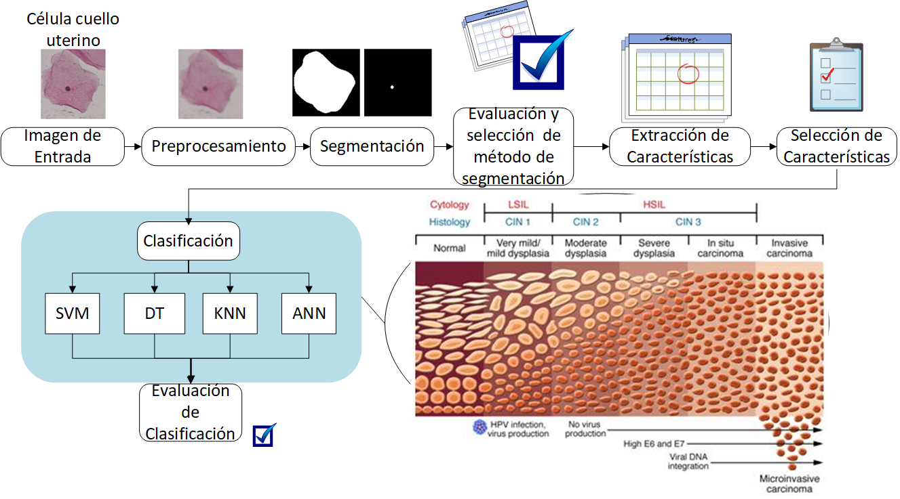
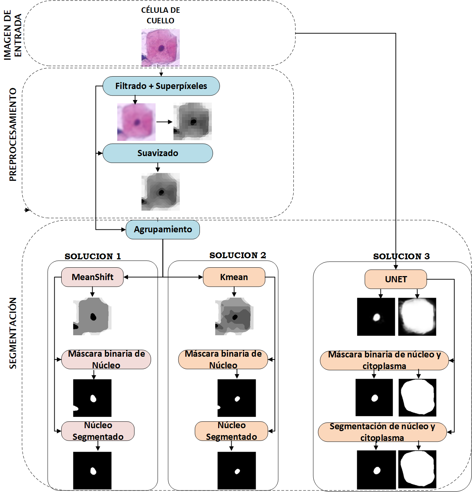
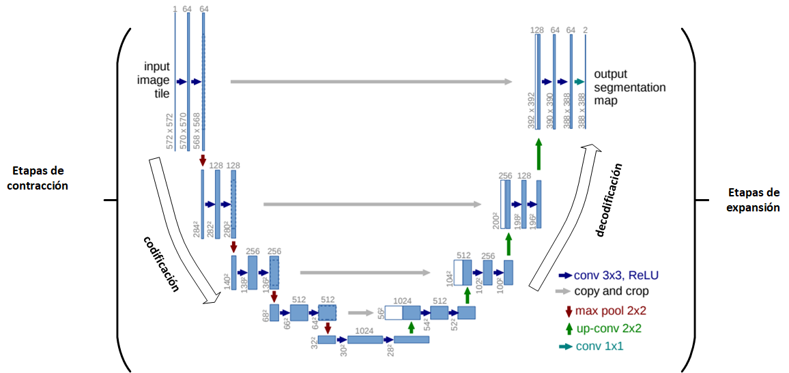

# Algoritmo de segmentación celular de imágenes de Papanicolaou para el apoyo diagnóstico de cáncer de cuello uterino

El análisis de frotis cervical, una técnica pionera descrita por Papanicolaou, ha
demostrado ser efectiva en la detección temprana de patologías y se utiliza
ampliamente en sistemas CAD para el diagnóstico automatizado. En este estudio, se
emplearon diversas técnicas de segmentación y clasificación de imágenes PAP con el
objetivo de apoyar el diagnóstico del cáncer de cuello uterino. Se utilizaron técnicas de
aprendizaje no supervisado, como KMEANS y MEANSHIFT, para llevar a cabo la
segmentación del núcleo celular. Estas técnicas se basan en el concepto de
agrupamiento para fusionar regiones de superpíxeles y lograr la segmentación deseada.
Además, se empleó la red UNET, un modelo de aprendizaje supervisado, para la
segmentación tanto del núcleo como del citoplasma. Para la realización de este
estudio, se utilizó la base de datos de HERLEV, que consta de 917 imágenes junto con
sus correspondientes segmentaciones y etiquetas. Esta base de datos facilitó el proceso
de aprendizaje y evaluación de las técnicas utilizadas en la investigación. En cuanto a
la clasificación, se emplearon cuatro clasificadores: DT, SVM, KNN y ANN, para
resolver problemas de clasificación binaria y de tres clases. Para mejorar el
rendimiento de la clasificación, se aplicaron técnicas como PCA y FeatureWiz para
obtener características significativas de las células. Los resultados obtenidos mostraron
que la red UNET fue altamente efectiva en la segmentación tanto del citoplasma como
del núcleo, obteniendo índices de Dice de 0.91 ± 0.044 y 0.90 ± 0.117,
respectivamente. En cuanto a la clasificación binaria, el clasificador ANN alcanzó una
exactitud del 98 %, mientras que para la clasificación de tres clases, el clasificador
KNN obtuvo una precisión del 89 %. Por tanto, este estudio demuestra la eficacia de
las técnicas de segmentación y clasificación utilizadas en el análisis de frotis cervical,
proporcionando resultados prometedores para el apoyo al diagnóstico de cáncer de
cuello uterino.

Algoritmo de segmentación semántica y clasificación de celulas de cáncer cervical de la prueba de Papanicolaou.

Esquema de modelo propuesto de segmentación y clasificación:

<p align="center">
  
</p>

Se realiza el preprocesamiento y segmentación de las imágenes de las células cervicales. Para aplicar los algoritmos Kmeans y Meanshift, es necesario preprocesar las imágenes utilizando técnicas de filtrado y generación de superpíxeles seleccionadas. 

<p align="center">
  
</p>


# Dataset link
1. [Herlev](http://mde-lab.aegean.gr/index.php/downloads)

Nota: base de datos disponible en el momento de realizar este proyecto.

# Intrucciones para ejecución del código

- Kmeans.
```
+--DatasetNormalizado
|   +-- Células del conjunto de datos
|   ...
+-- Codigos_F
+-- Arhivos CSV
+-- Kmeans.ipynb

```
El archivo Kmeans.ipynb contiene todas las fases correspondientes a la segmentación del núcleo junto con los archivos de las métricas de evaluación y las características extraídas. 

- Meanshift.
```
+--DatasetNormalizado
|   +-- Células del conjunto de datos
|   ...
+-- Codigos_F
+-- Arhivos CSV
+-- Meanshift.ipynb

```
El archivo Meanshift.ipynb contiene todas las fases correspondientes a la segmentación del núcleo junto con los archivos de las métricas de evaluación y las características extraídas. 

- UNET <br>
Estrucutra UNET

<p align="left">
  
</p>

Si se quiere volver a entrenar, correr los archivos de la carpeta NUCLEOUNET y CITOUNET para núcleo y citoplasma respectivamente.

debe tenr la siguiente extructura de carpetas y archivos 

```
+-- CELULAS  -- train
+-- MASCARAS -- referencia
+-- PRUEBA   -- test
+-- preprocesamiento.ipynb
+-- entrenamientoUnet.ipynb
```

De lo anterior, se obtienen los modelos y sus pesos entrenados.  

El modelo y los pesos pre-entrenados de la red UNET deben descargarse y pegarse en la carpeta PesosModelo <br>
Estos son necesarios para probar el algoritmo de segmentación con la red UNET de células de forma individual.
[pesos UNET](https://unicaucaeduco-my.sharepoint.com/:f:/g/personal/yeinerimbachi_unicauca_edu_co/Eu-QzwGsQLFAjr8YeqswUM8BsQJPxarAX6DfmvhCaT5_XA?e=gfJJYj) <br>

El proyecto tiene la siguiente extructura de carpeta y archivos:


```
+-- Codigos_F
|   +-- funciones.py
|   +-- rotating_calipers.py
+-- PesosModelo
|   +-- unetCito2.h5
|   +-- unetCitoPesos2.h5
|   +-- unetNucleo4.h5
|   +-- unetNucleoPesos4.h5
+--DatasetNormalizado
|   +-- Células del conjunto de datos
|   ...
+--Arhivos CSV
|   +-- .csv
|   ...
+-- UNET.ipynb

```
En el archivo UNET.ipynb se realiza la segmentación UNET de núcleo y citoplasma junto con los archivos csv que contienen las métricas de evaluación de cada imagen y el conjunto de características extraídas. De igual forma, permite realizar la clasificación para problemas de dos y tres clases, con los modelos KNN y ANN.

La Carpeta "Codigos_F" contiene las funciones con las técnicas de preprocesado, segmentación, caracterización y evaluación con los parámetros ya establecidos.

1. instalar los paquetes necesarios:
```
pip install -r requirements.txt
```


